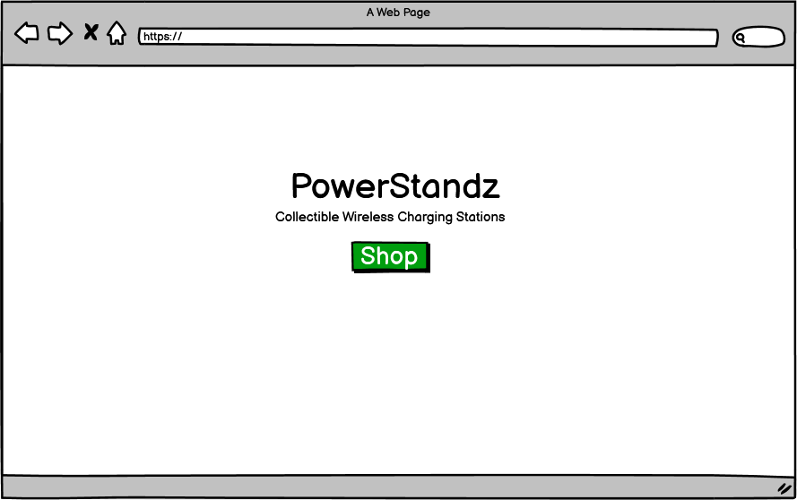
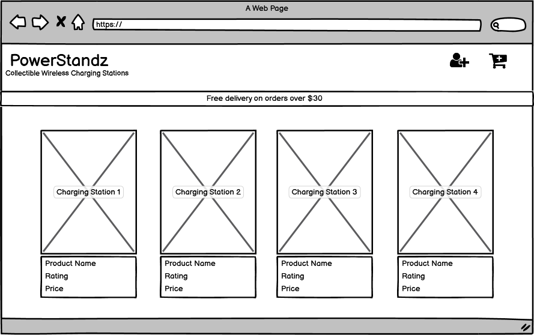
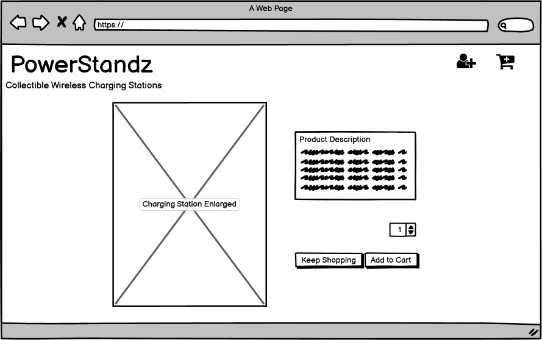
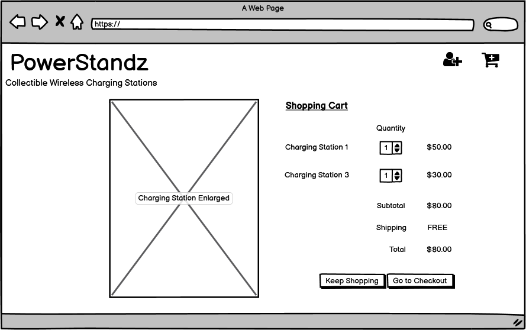
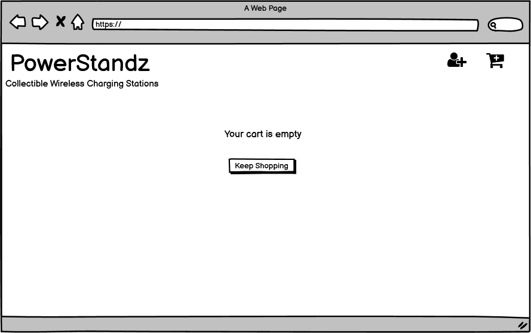
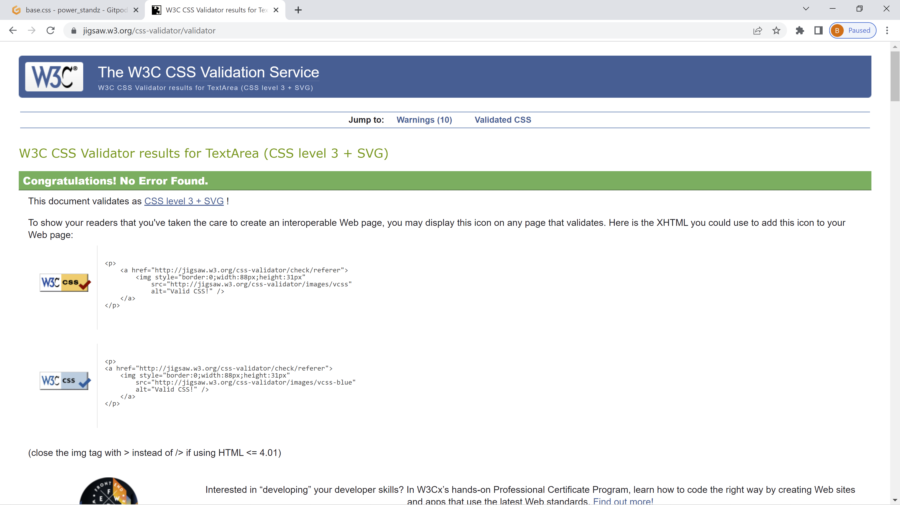
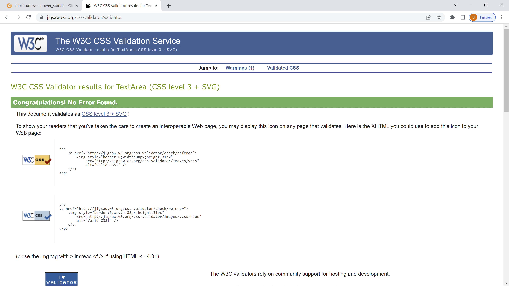
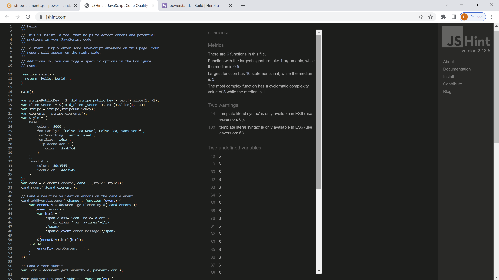
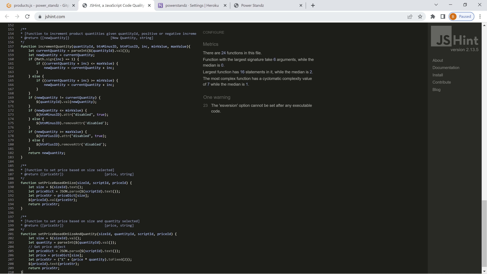
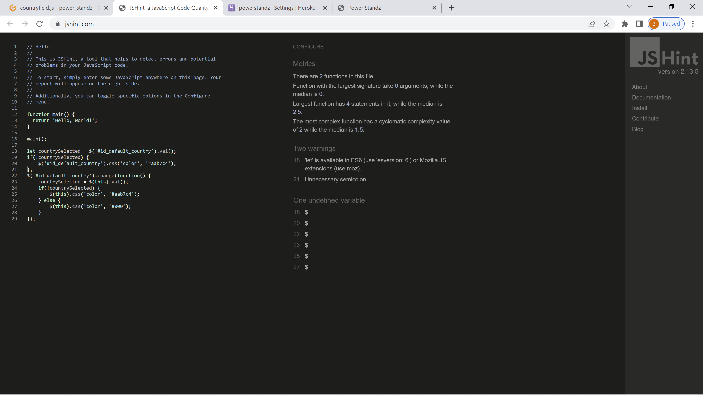

<h1 align="center"></h1>

[PowerStandz Live Site](https://powerstandz.herokuapp.com/)

<h1 align="center"></h1>

This is Brian Lipscombe's fourth Milestone Project (Full Stack Frameworks with Django) at [Code Institute](https://codeinstitute.net). It was built using HTML5, CSS3, JavaScript, Python+Django, Postgres, Stripe, AWS, Gitpod, and deployed on Heroku. It is designed with Code Institute's Assessment Handbook Project Idea 0 in mind - Bring your own idea to life, based on providing value to users to address a specific real or imagined need.

The idea is to sell custom collectible device-charging stations that are inspired by popular film and TV concepts.

Please note that at this stage, PowerStandz is a fictitious eCommerce store created for the purposes of satisfying the requirements for the Code Institute Full Stack Development Course Milestone Project 4.

Also, please note, constraints in student-level skill set, along with a lack of time to study while working full time and supporting a family, played major parts in the current state of this project.

## User Experience (UX)

* User Stories

1. As a Potential Customer, I would like to be able to:

    - Immediately understand the intent of the site.
    - View and navigate the site on all devices.
    - Learn about the chargers with a description of each, so I can make an informed purchasing decision.
    - Understand the delivery charges, and how much I need to spend to get free delivery, so I can make an informed purchasing decision.
    - Add products to my cart, so I can make a purchase.
    - Receive confirmation of my purchase via email, so I can be confident that the purchase has been made successfully.
    - Register on the site, so I can make a repeat purchase more easily.
    - Contact the business via social media links with inquiries.

2. As a Registered User, I would like to be able to:

    - Sign in to my account.
    - Sign out of my account.
    - Recover a forgotten password.
    - View and update my personal profile.
    - See a summary of my orders.
    - Contact the business via social media links about a specific order.
    - Add reviews to products (this feature will be added).

3. As a Business Owner, I would like to be able to:

    - Add, edit, and delete products.
    - Edit product prices.
    - Delete product reviews that are illegitimate or offensive.

* Design

1. Color Scheme

    - Black, white, and shades of green are mainly used throughout the site to compliment the custom logo design that intends to offer plenty of contrast and a simply yet energetic vibe. 

2. Imagery

    The background image and logo were designed by the developer using Adobe Photoshop. All of the product images were taken from the following sites and edited by the developer also using Adobe Photoshop: 
    [Morpheus](https://www.reddit.com/r/shittymoviedetails/comments/kdzzls/in_the_matrix_1999_neo_can_either_take_either_the/) 
    [FleetwoodLab](https://www.amazon.de/-/en/Greenlight-GREEN86500-Fleetwood-Bounder-Breaking/dp/B07B7LSR2M) 
    [StarDestroyer](https://specialtyproducts.store/imperial-star-destroyer-star-wars-metal-model-kit-iconx/) 
    [Jaws](https://www.bbc.com/news/newsbeat-33591730) 
    [Thor'sHammer](https://fireandsteel.ca/products/marvel-avengers-thors-hammer) 
    [DoctorStrangeEnergySpell](https://www.instructables.com/Dr-Strange-Spell-Props/) 
    [TheBatmanChestplate](https://geekculture.co/robert-pattinson-the-batman-symbol-seems-to-be-using-gun-parts-from-wayne-murder/) 
    [Grogu](https://starwars.fandom.com/wiki/Hovering_pram) 
    [CaptainAmericaShield](https://www.artstation.com/artwork/mqWbl1) 
    [PulpFictionBriefcase](https://www.123rf.com/photo_117274967_black-leather-business-briefcase-on-white-background.html?vti=m4upeylkb5urkyxzat-1-68) 
    [AlienEgg](https://www.wantitall.co.za/toys/alien-foam-and-latex-life-size-egg-and-facehugger-prop-replica-with-led-lights__b01850nqhu) 
    [DarthVader](https://www.rsfigures.com/collections/darth-vader/products/royal-selangor-hand-finished-star-wars-collection-pewter-darth-vader-bust) 
    [smartphones](https://www.freepnglogos.com/pics/smartphone) 
    [PS5Controllers](https://www.pngall.com/playstation-5-png/download/47893)

3. Typography

    All fonts were kept basic for easy readability, except for the logo which was designed in Adobe Photoshop using Charlemagne Std Bold font as well as additional layers for added flare and subtle glowing energetic feel.

## Features

* Purchase Products
* Product Details
* Registration Form
* Sign In
* Sign Out
* Update Profile
* Recover Password
* Order Summary
* Add Product
* Edit Product
* Delete Product
* Edit Prices
* Secure Checkout

## Wireframes
<h1 align="center"></h1>
<h1 align="center"></h1>
<h1 align="center"></h1>
<h1 align="center"></h1>
<h1 align="center"></h1>

## Technologies Used

* [HTML5](https://en.wikipedia.org/wiki/HTML5)

* [CSS3](https://en.wikipedia.org/wiki/CSS)

* [JavaScript](https://en.wikipedia.org/wiki/JavaScript)

* [Python3](https://www.python.org/download/releases/3.0/)

* [Django](https://www.djangoproject.com/)

* [Heroku](https://signup.heroku.com/)

* [AWS](https://aws.amazon.com)

* [Stripe](https://stripe.com/)

* [Font Awesome](https://fontawesome.com/)

* [Github](https://github.com/)

* [Gitpod](https://www.gitpod.io/)

* [Git](https://en.wikipedia.org/wiki/Git)

* [Chrome Dev Tools](https://developer.chrome.com/docs/devtools/)

* [Bootstrap](https://getbootstrap.com/)

* [jQuery](https://jquery.com/)

* [Balsamiq](https://balsamiq.com/)

## Testing

* Clicked on all buttons and navigation links to verify that they direct to the proper pages.

* Verified that when each product image is clicked that they direct to that product's details pages.

* Verified that the product quantity counter functions correctly when the + and - buttons are clicked.

* Verified that the ADD TO CART button will add the proper amount of products specified into the cart.

* Verified that the cart toast messages appear and include a close out button, scrolling capabilities for multiple separate items added, and a GO TO SECURE CHECKOUT button that directs to the checkout page when clicked, and that the correct products appear.

* Verified that the checkout form works properly and allows users to complete orders via stripe.

* Verified that products can be remove and updated in the checkout page.

* Verified if the register button is clicked, register page allows user to register an email, username, and password.

* Verified that the log in button directs the user to the sign in page.

* Verified that the 'search' button retrieves the correct product that is relevant to the key terms the user searched for.

* Verified that when a user is logged in, they are able to add, edit, and delete products. 

* Verified that if a user forgets their password a reset password option is available.

* Verified that the social media links direct to the appropriate social sites.

## Responsiveness

* This project is confirmed to be responsive on all standard screen sizes using the devtools device toolbar.

## Browser Validation

* This project is confirmed to work with different browsers: Chrome and Internet Explorer. This project has also been tested using different mobile devices, laptops, and a desktop.

* Lighthouse Auditing

    - Scores are currently suboptimal but will hopefully be improved especially if resubmission is deemed necessary. Converting all media files from PNG to WebP format might fix this. Please note, when previously attempting to use WebP files, they did not load properly in Gitpod or in the browser. For this reason PNG files were used.

All pages were tested on multiple resolutions for proper responsiveness.

All files and pages were validated by direct input using:

* [Nu Html Checker](https://validator.w3.org/#validate_by_input)
    - Errors currently exist but will hopefully be resolved if resubmission is deemed necessary.

* [W3C CSS Validation Service](https://jigsaw.w3.org/css-validator/)
    - No errors found.
<h1 align="center"></h1>
<h1 align="center"></h1>   

* [JSHint](https://jshint.com/)
    - No errors found, only a few warnings.
 <h1 align="center"></h1>
 <h1 align="center"></h1>
 <h1 align="center"></h1>   

* [PEP8](http://pep8online.com/)
    - Errors and warnings currently exist in multiple py files in this project, but some will hopefully be resolved if resubmission is deemed necessary. Please note, feeble attempts to fix some of these problems caused server errors after pushing to Heroku and were therefore undone, and then intentionally left in the original syntax, as provided in the Code Institute Boutique Ado walkthrough source code.

## Heroku Deployment
1. Set up local workspace for Heroku
    - In terminal window type: pip3 freeze -- local > requirements.txt. (The file is needed for Heroku to know which file to install.)
    - In termial window type: python app.py > Procfile (The file is needed for Heroku to know which file is needed as entry point.)
2. Set up Heroku: Access Heroku account and create a new app and select region.
3. Deployment method 'Github'
    - Click on the Connect to GitHub section in the deploy tab in Heroku.
    - Search to connect with the proper repository.
    - When repository appears click on connect to connect the repository with Heroku.
    - Go to the settings app in Heroku and go to Config Vars. Click on Reveal Config Vars.
    - Enter all necessary variables.
4. Automatic deployment: Go to the deploy tab in Heroku and scroll down to Aotmatic deployments. Click on Enable Automatic Deploys. By Manual deploy click on Deploy Branch.
5. Add, commit, and push.
    - $ git add .
    - $ git commit -m ""
    - $ git push 
    - This will automatically push to Heroku

  Heroku will receive the code from Github and host the app using the required packages. Once the build is complete, click on Open app in the right corner of Heroku account. The app wil open and the live link is available from the address bar.

## Known Bugs

* The company logo is not as responsive on all screens as it should be. For instance, it appears fine on mobile screen size 320px, but then becomes off center as the screen size increases, then on the largest screen setting it is smaller than preferred. Attempts at fixing this were made but unsuccessful, and due to a lack of time, it was not completely fixed.

* Stripe disabled webhook endpoint. Unsure why this occurred but the disabled webhook endpoint was manually enabled again in Stripe settings.

## Future Improvements

* Convert PNG images to WebP format so that Gitpod and the browser will actually load them properly. This will hopefully earn a better Lighthouse performance score.

* Add a confirmation message after users click delete before orders are deleted.

* Fix custom logo's responsiveness on all screen sizes.

* Add product reviews section and contact form if possible.

## Credits

* Code

    Code used as a template throughout this project was borrowed from the Code Institute Boutique Ado walkthrough by Chris Zielinski found [here.](https://github.com/Code-Institute-Solutions/boutique_ado_v1/tree/250e2c2b8e43cccb56b4721cd8a8bd4de6686546)

    Code for the footer in this project was borrowed from the Code Institute MS4 project entitled Perkulator by Richard Ash found [here.](https://github.com/richardhenyash/perkulater)
    
    Other Code was taken from frameworks and toolkits such as [bootstrap](https://getbootstrap.com/) and [Font Awesome](https://fontawesome.com/).

    All other code was written or edited by the developer. 

## Acknowledgements

* Guidance and Moral Support

    Code Institute on Slack. To say this course was difficult for me would be an understatement. Without Slack, I would have never been able to solve countless, mind-numbing problems.
    
    My mentor, Narender Singh, for helping me as much as I was capable of comprehending, even though I was unable to schedule proper sessions due to major time constraints and unforeseen scheduling conflicts.  
    
    Most importantly my family, for dealing with me and my crazy work and studying schedules. For believing in me, that I might actually receive a diploma in software development!  

This site was developed for educational purposes only.